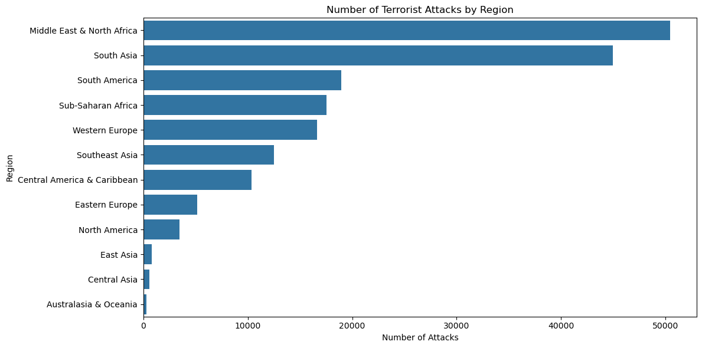
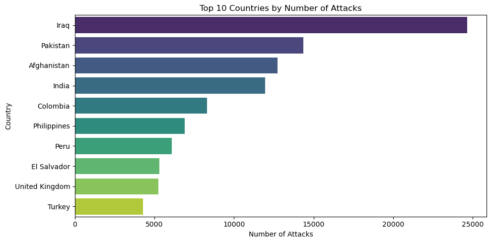
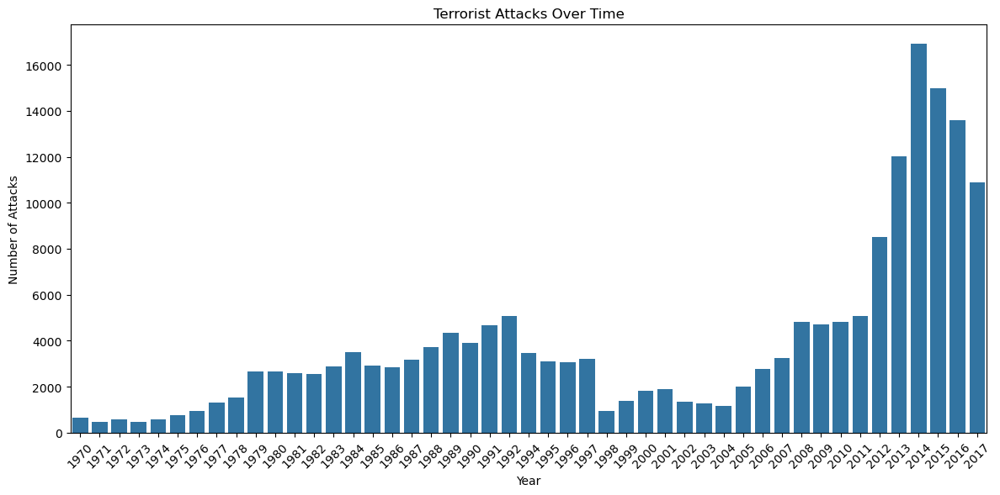
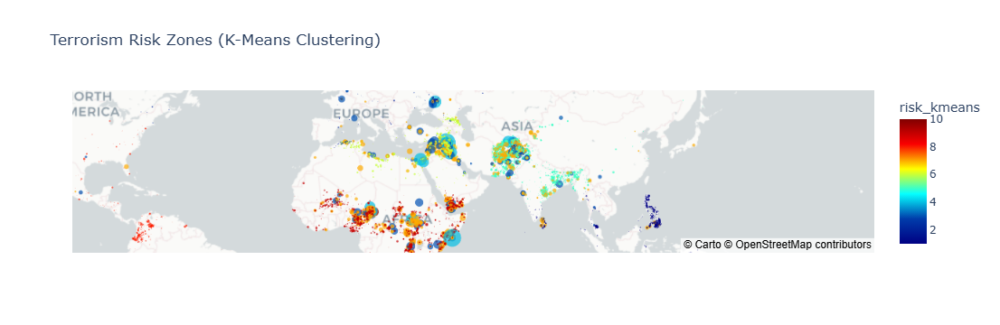

## Use Machine Learning to Classify Geographic Terrorism Risk Clusters
**Hongfei Hou**
### Link to the Jupyter notebook
[My Jupyter notebook](https://github.com/jeffhonghou/Global_Terrorism_Analysis/blob/main/Main.ipynb)

### Executive summary
**Project overview and goals:** This project explores how machine learning can help identify areas with different levels of terrorism risk using data from the Global Terrorism Database. The main goal is to use historical data from 1970 to 2017 to classify regions as high-risk, medium-risk, or low-risk, so travelers can make safer and more informed choices. The dataset includes over 180,000 incidents, with details like where each attack happened, how many people were hurt or killed, and the type of attack. Before using the data, I cleaned it up via removing missing values, choosing the most useful features, and calculating how severe each attack was. I then used machine learning model like K-Means, DBSCAN, and Gaussian Mixture Models to group locations with similar risk patterns. The goal is to turn this complex data into easy-to-understand insights and visuals, like maps. Ultimately, the project aims to build a strong base for an interactive tool that helps people check the terrorism risk of a location before they travel.

**Findings:** This project uncovered several important patterns in global terrorism. High-risk areas were mostly found in regions with long-term conflict or political instability—such as parts of the Middle East, South Asia, and Sub-Saharan Africa. 

Among the models used, both KMeans and DBSCAN did a particularly good job at identifying areas with a high number of deadly attacks. The visual maps created from the data clearly showed the difference between safer regions and those with more frequent or severe incidents. Looking at trends over time, the analysis showed that while the number of attacks changed from year to year, certain dangerous areas remained active for decades. It also became clear that the majority of casualties were concentrated in just a few locations, meaning that not all attacks had the same level of impact. In the end, the clustering method gave a more detailed and location-specific picture of terrorism risk, showing how machine learning can help analyze and understand global threats.

**Results and conclusion:** This project showed how unsupervised machine learning can be used to find and visualize areas around the world with different levels of terrorism risk. By combining location data (latitude and longitude) with the severity of attacks (based on the number of people killed or injured), the models—K-Means and DBSCAN—were able to group regions into three main risk levels: high, medium, and low. K-Means did especially well at spotting the expected 10 dense clusters. The high-risk zones it found matched well with real-world conflict areas like Iraq, Pakistan, and Afghanistan.

Interactive maps created with Plotly helped clearly show where risks were higher, and when terrorism peaked—especially around 2014. Some regions remained dangerous over many years, while others had short bursts of violence.

One important insight is that this method looks not just at how often attacks happen, but also how severe they are. This makes it useful for real-world applications like travel safety planning. However, the project has some limits—it doesn't predict future changes like political events, and it doesn't use deeper information like the reasons behind each attack.

In the end, this project proves that machine learning can turn complex data into useful insights, and it opens the door for future tools that can track threats over time and adapt quickly to new information.

**Next steps and recommendations:** To make this project more effective, the next step is to build a simple, user-friendly dashboard that displays real-time risk zones. This would allow users—such as travelers—to explore different regions and get up-to-date insights on terrorism risk. I also recommend updating the model with more recent terrorism data (from after 2017) or adding other trustworthy data sources to keep the analysis relevant. On the technical side, it's worth exploring different methods for grouping the data (clustering), and improving the features being used—like including details about the type of attack or the amount of property damage. It is also necessary to re-examine how to balance the impact of deaths versus injuries, as this can affect the overall risk assessment. Finally, it is needed to review how risk levels are defined and matched to the underlying data to make sure the results are accurate and dependable.
With these upgrades, the project can grow beyond a basic concept and become a valuable tool for helping individuals better understand and prepare for terrorism risks around the world.

#### Research question:
Can we identify high-risk geographic clusters of terrorism attacks using the Global Terrorism Database on Kaggle, to support pre-travel guidance and decision-making?

#### Data Source and Attribution
The analysis will use the Global Terrorism Database (GTD), available on Kaggle: https://www.kaggle.com/datasets/START-UMD/gtd. This dataset contains detailed records of over 180,000 terrorist incidents worldwide from 1970 to 2017, including date, location, weapons used, target type, and casualties.
> **Citation**:  
> National Consortium for the Study of Terrorism and Responses to Terrorism (START), University of Maryland. (2018).  *The Global Terrorism Database (GTD) [Data file].*  Retrieved from [https://www.start.umd.edu/gtd](https://www.start.umd.edu/gtd)

> **Copyright Notice**:  
> Copyright University of Maryland 2018.

> **Data Modifications**:  
> This analysis includes preprocessing of the original GTD dataset, including:
> - Filtering for relevant columns (e.g., country, region, latitude, longitude, casualties),
> - Handling missing values,
> - Creating a "casualties" column to represent attack severity.
>  
> These transformations were made solely for clustering and visualization purposes. They do not reflect any analytical decisions or interpretations made by the National Consortium for the Study of Terrorism and Responses to Terrorism (START), headquartered at the University of Maryland.

#### Techniques to use:
* Data Preprocessing: Handle missing values, and filter relevant periods and columns (e.g., country, region, latitude, longitude, number of casualties, and attack type).
* Exploratory Data Analysis: Visualize attack frequency by region, time trends, and severity.
* Clustering Models: Since my main task is to cluster geographic regions into risk zones, I will use unsupervised learning models like K-Means or DBSCAN on spatial and severity features (e.g., latitude, longitude, casualties) to group areas into high, medium, and low-risk zones.
* Visualization: Use Plotly to provide visual risk maps.

#### Expected results:
* Creation of distinct geographic clusters that classify regions into high, medium, and low-risk zones based on historical terrorist activity.
* Plots showing attack density and severity across continents and countries.

#### Why this question is important
The question is important because it can help travelers and organizations assess security risks for travel destinations, enhance public awareness and preparedness for travel in sensitive regions, and transform raw terrorism data into actionable intelligence for both individuals and institutions. 

### Exploratory data analysis
The Global Terrorism Database comprises 181,691 records across 135 features, covering incidents from 1970 to 2017. A noticeable surge in terrorist activity occurred between 2008 and 2017. The Middle East and North Africa region experienced the highest volume of attacks, followed by South Asia, with Iraq emerging as the most affected country. Bombings and explosions were identified as the most commonly employed method of attack. 
Columns such as summaries, notes, and motives—as well as others suited for forensic or behavioral analysis but not directly relevant to geographic risk clustering—were removed. Additional fields were manually excluded, resulting in a final dataset containing the following nine columns: 'iyear', 'country_txt', 'region_txt', 'city', 'latitude', 'longitude', 'nkill', 'nwound', and 'attacktype1_txt'.
Due to the large dataset size and limited local computing resources, I reduced the sample by selecting data from only the most recent ten years.

### Model Training
To reflect the greater severity of fatalities compared to non-fatal injuries, fatalities (nkill) were assigned a higher weight in the clustering process. This approach aligns with standard practices used by organizations such as the WHO, UN, and global security analysts, who often weight deaths 2 to 10 times more heavily than injuries in risk and burden assessments. In this analysis, a weight of 3 was applied to nkill, following the commonly adopted strategy of triple-weighting fatalities to prioritize loss of life.
#### KMeans Model
The number of clusters was set to 10 to align with a 10-point risk scale, where 1 represents minimal risk and 10 represents the highest risk level.
#### DBSCAN Model
A range of eps values was tested: [0.25, 0.30, 0.35, 0.45, 0.50, 0.55, 0.60, 0.65, 0.70, 0.75, 0.80]. The optimal value was found to be 0.75, which yielded the highest silhouette score and therefore the best clustering performance.
#### Gaussian Mixture Models (GMM)
Different numbers of components were tested, ranging from 2 to 10. The best performance was achieved with 2 components, which resulted in the highest silhouette score among the configurations evaluated.

### Model evaluation
The silhouette score was used to evaluate model performance, as it is a key metric in unsupervised learning—particularly for clustering algorithms like KMeans, DBSCAN, and Gaussian Mixture Models. Among the models tested, DBSCAN achieved the highest silhouette score of 0.5654, indicating the best clustering quality. KMeans followed with a score of 0.4315, which still reflects a strong clustering structure. Notably, DBSCAN identified 13 clusters, closely aligning with the expected target of 10, suggesting it effectively captured the data's underlying patterns. However, a major limitation of DBSCAN is its inability to perform predictions on new or unseen data points, which restricts its practicality for future risk assessments, such as evaluating travel risk for new locations. Taking both performance and usability into account, KMeans was selected as the final model, as it offers a balance between solid clustering performance and the ability to generalize to new data through predictive capabilities.
Below is the table used to translate the estimated scale into travel risk titles:
| Scale | Travel Risk Title     | Remarks                                                                                     |
|-------|-----------------------|---------------------------------------------------------------------------------------------|
| 1–2   | Very Low Risk         | Historically very few or no incidents with kills or wounds, even in surrounding areas.      |
| 3–4   | Low Risk              | Significantly low number of attacks with kills, or wounds.                                 |
| 5–6   | Moderate Risk         | Average number of attacks with kills, or wounds; exercise normal caution.                   |
| 7–8   | High Risk             | Above-average number of incidents; travel is strongly discouraged.                         |
| 9     | Very High Risk        | Frequent attacks with high casualties; travel is strongly discouraged.                     |
| 10    | Extreme Risk          | Extremely high number of attacks or casualties; travel is not advised under any condition. |

### Use case: Predict risk level of Tehran, Iran to support pre-travel guidance and decision-making 
Based on the trained KMeans model, the predicted risk level for Tehran, Iran is 6, corresponding to a classification of "Moderate Risk." This indicates a historically average number of attacks involving fatalities or injuries. While it is generally safe to travel to Tehran, it is advisable to exercise normal caution

